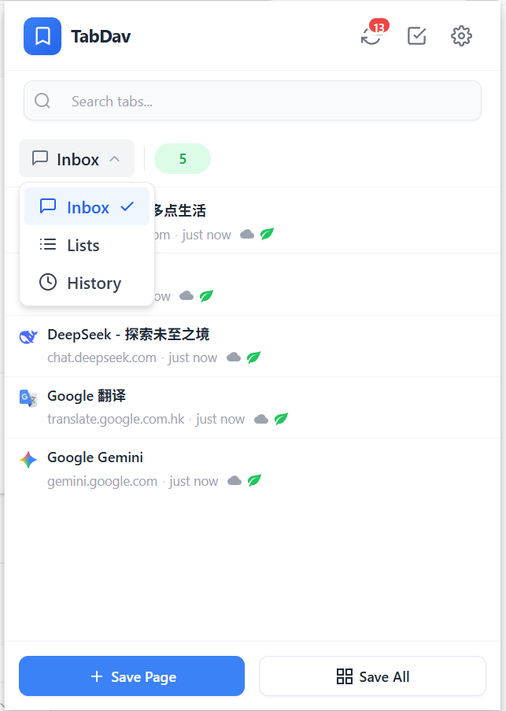
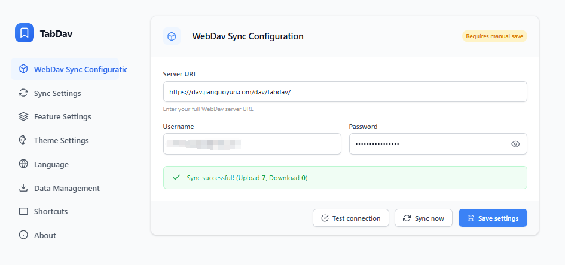
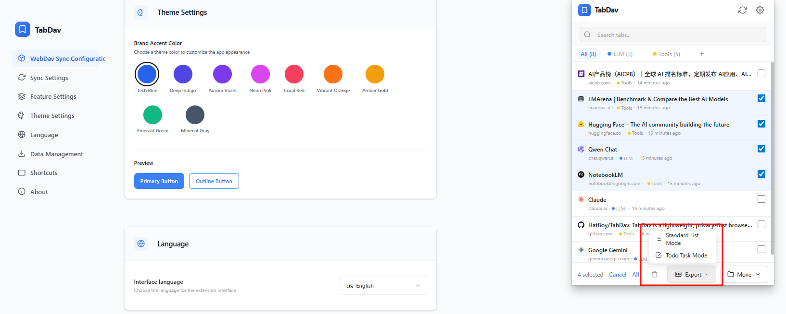

# TabDav

<div align="center">

**Sync your tabs, own your data.**

<p align="center">
  
  
  
</p>

[中文文档](README_ZH.md) | [🐞 Report Bug](../../issues)

</div>

---

## 📖 Introduction

**TabDav** is a lightweight, privacy-first browser extension designed to manage and synchronize your browser tabs across multiple devices using the **WebDAV** protocol.

Unlike other "Read It Later" tools or tab managers that lock your data in proprietary clouds, TabDav gives you full control. You can sync your tabs using your own Nextcloud, SFTPGo, NAS (Synology/QNAP), or any WebDAV-compatible cloud storage.

**Your data stays with you. Secure, private, and free.**

## ✨ Key Features

* **🔒 Privacy First**: Zero tracking. Your browsing history and saved tabs are never sent to our servers. They live strictly on *your* WebDAV server.
* **☁️ Cross-Device Sync**: Save tabs on your work PC and restore them on your home laptop instantly.
* **⚡ Productivity Toolkit**: Supports **Tab Grouping** for better organization, **Markdown Export** for your notes (Obsidian/Notion ready), and **Custom Themes** (Light/Dark).
* **🌍 Multi-language Support**: Fully localized for English, Simplified/Traditional Chinese, Japanese, German, French, Spanish, Portuguese, and Russian.
* **🚀 Lightweight**: No bloatware. A clean, efficient UI focused purely on productivity.

## 📸 Screenshots

### 1. Tab Management
*Save your current window's tabs with one click.*



### 2. Settings
*Easily configure your WebDAV endpoint.*



### 3. Toolkit
*Tab Grouping for better organization, Markdown Export for your notes*




## 🛠 Installation

### Option 1: Load Unpacked (Recommended for now)
1.  Download the latest release code or clone this repository.
2.  Open Chrome or Edge and navigate to `chrome://extensions/`.
3.  Toggle **Developer mode** (top right corner).
4.  Click **Load unpacked** and select the extension directory.

### Option 2: Web Store
* *Chrome Web Store: [Coming Soon]*
* *Edge Add-ons: [Coming Soon]*

## ⚙️ Configuration

1.  Click the **TabDav icon** in your browser toolbar.
2.  Click the **Settings (Gear)** icon.
3.  Enter your WebDAV credentials:
    * **Server URL**: e.g., `https://dav.jianguoyun.com/dav/` or `https://your-nextcloud.com/remote.php/webdav/`
    * **Username**: Your WebDAV username.
    * **Password**: Your WebDAV password (or App Password).
4.  Click **Save**. If the connection is successful, you are ready to sync!

### ✅ WebDAV Server Compatibility

TabDav has been tested and verified with the following providers:

* **SFTPGo**
* **Nextcloud**
* **ownCloud**
* **Seafile**
* **Nutstore (Jianguoyun)**
* Any other server adhering to the standard WebDAV protocol

### ⚠️ Important Note on CORS (Server Configuration)

Since TabDav runs directly in your browser, it is subject to standard browser security policies regarding **Cross-Origin Resource Sharing (CORS)**.

If you are using a self-hosted WebDAV server (e.g., Nginx, Apache, or custom NAS setup), you **must** configure your server to:

1.  **Allow Cross-Origin Requests**: Return the `Access-Control-Allow-Origin` header (set to `*` or the extension's ID).
2.  **Allow the `OPTIONS` Method**: The server must strictly accept and respond to `OPTIONS` preflight requests with a `200 OK` status.
3.  **Allow Custom Headers**: Ensure headers like `Content-Type`, `Authorization`, and `Depth` are allowed in `Access-Control-Allow-Headers`.

*Note: Most commercial cloud WebDAV providers (like Jianguoyun) support this out of the box. This usually only applies if you are hosting your own server.*

## 💻 Local Development

If you want to contribute or build it yourself:

```bash
# 1. Clone the repository
git clone [https://github.com/HatBoy/TabDav.git](https://github.com/HatBoy/TabDav/TabDav.git)

# 2. Install dependencies
npm install

# 3. Build for production
npm run build
```