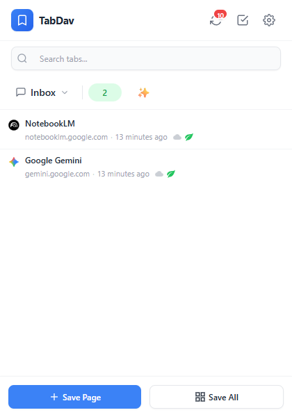
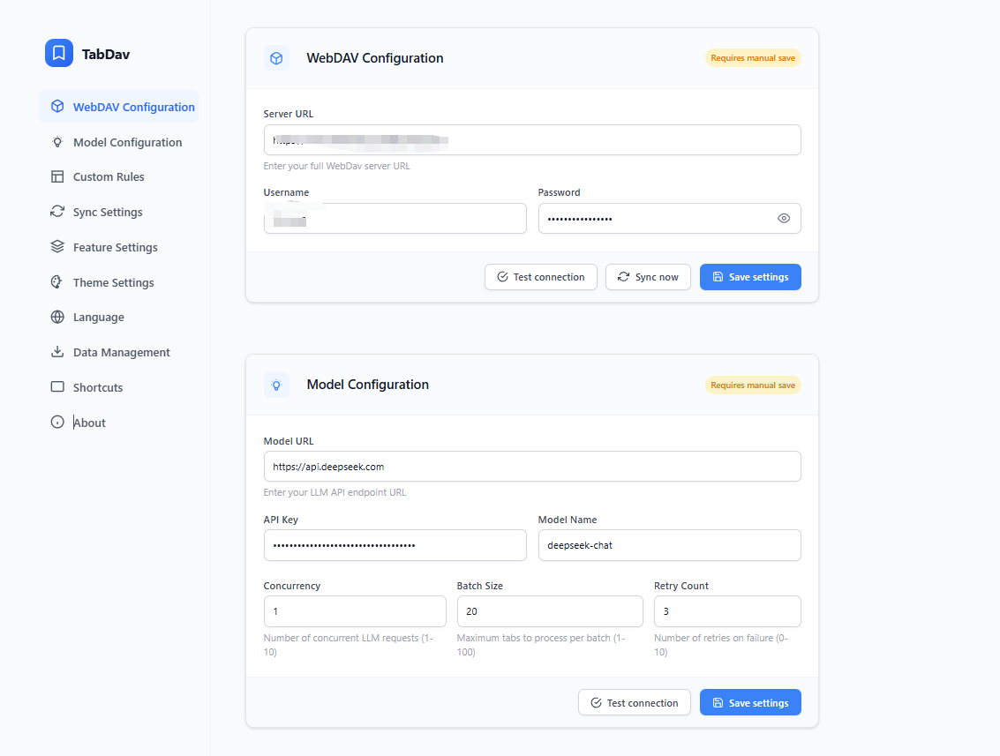
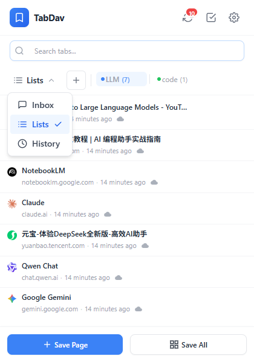
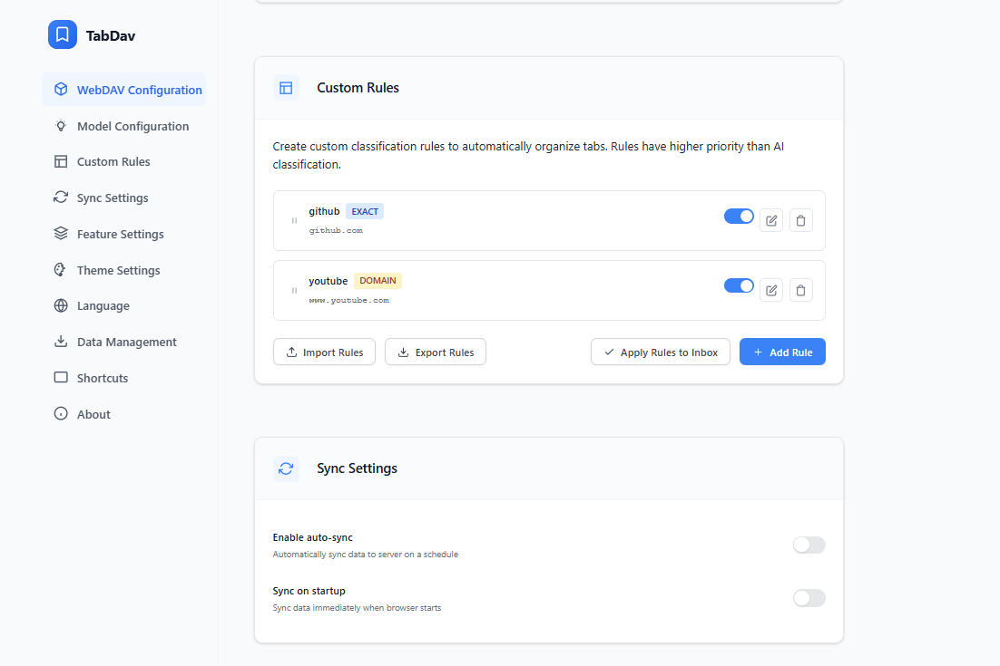
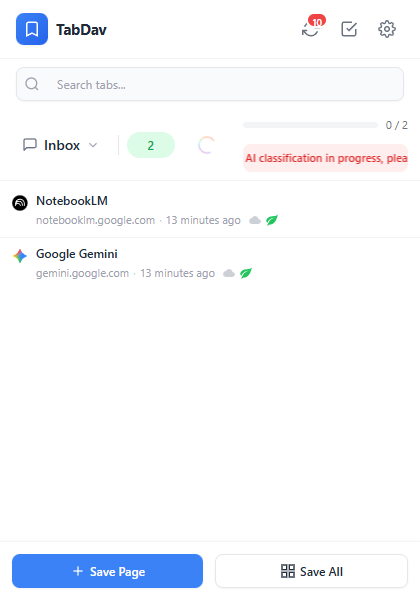

# TabDav

<div align="center">

**Stop Hoarding. Start Flowing.**
**The Browser Buffer for Your Second Brain.**
**Sync your tabs, own your data.**

<p align="center">
  
  
  
</p>

[中文文档](README_ZH.md) | [🐞 Report Bug](../../issues)

</div>

---

## 📖 Introduction

**TabDav** is a lightweight, privacy-first browser extension designed to manage and synchronize your browser tabs across multiple devices using the **WebDAV** protocol.

Unlike other "Read It Later" tools or tab managers that lock your data in proprietary clouds, TabDav gives you full control. You can sync your tabs using your own Nextcloud, SFTPGo, NAS (Synology/QNAP), or any WebDAV-compatible cloud storage.

**Your data stays with you. Secure, private, and free.**

## 📖 Redefining Tab Management

**TabDav** has evolved. In v2.0, we reimagined it from a simple "Bookmark Syncer" to a **"Browser Buffer"** designed for knowledge workers who use tools like Notion, Obsidian, or Logseq.

We believe your browser shouldn't be a graveyard for information.
* **TabDav is RAM**: For temporary buffering, triaging, and processing.
* **Your Notes App is HDD**: For permanent storage.

**The goal is turnover, not storage.**

## ✨ Key Features

* **🔒 Privacy First**: Zero tracking. Your browsing history and saved tabs are never sent to our servers. They live strictly on *your* WebDAV server.
* **☁️ Cross-Device Sync**: Save tabs on your work PC and restore them on your home laptop instantly.
* **⚡ Productivity Toolkit**: Supports **Tab Grouping** for better organization, **Markdown Export** for your notes (Obsidian/Notion ready), and **Custom Themes** (Light/Dark).
* **🌍 Multi-language Support**: Fully localized for English, Simplified/Traditional Chinese, Japanese, German, French, Spanish, Portuguese, and Russian.
* **🚀 Lightweight**: No bloatware. A clean, efficient UI focused purely on productivity.

## ✨ Core Features (v2.0)

### 1. 📥 Inbox & Natural Entropy
Your Inbox is a temporary landing zone. To prevent clutter, we introduced a visual aging mechanism based on **Natural Entropy**:
* **< 3 days**: Text is clear and vibrant, indicated by a green leaf.

* **3 - 7 days**: Tabs wither, indicated by a yellow leaf.

* **> 7 days**: The system automatically archives them to history (indicated by a gray wind), keeping the Inbox clean.

### 2. ⚡ Dual-Mode Lists
Not all tabs are created equal. Create lists with specific intents:

#### ✅ Action List (For Doing)
* **Metaphor**: Tasks, Jira tickets, Bug fixes.
* **Interaction - "Open & Drop"**: Clicking the title opens the tab and **immediately removes it** from the list. It pushes you to focus on the task.


#### 📖 Buffer List (For Reading)
* **Metaphor**: Resources, Reading list, Research materials.
* **Interaction - "Open & Keep"**: Clicking the title opens the tab but keeps it in the list for reference.
* **Harvest - "Export & Clear"**: A dedicated button to **Copy all items as Markdown** and clear the list instantly. Paste perfectly into Obsidian/Notion.

### 3. 🧠 AI Smart Sort
Overwhelmed Inbox? Let LLM handle the triage, going beyond simple keyword matching.

#### 🎯 Intent-First Sorting —— *Understanding Context*
* **Metaphor**: An experienced Executive Assistant or Librarian.
* **Logic - Context Awareness**: The AI analyzes not just the title, but the URL structure and your list types.
    * It routes `Jira`, `Figma`, or `GitHub Issues` links directly to your **Action Lists**.
    * It routes `Medium`, `YouTube`, or `Blog` posts directly to your **Buffer Lists**.

#### 🛡️ Zero Chaos Policy —— *Preventing Entropy*
* **Metaphor**: A Professional Organizer, not a Builder.
* **Principle - No Auto-Creation**: The AI is **strictly forbidden** from creating new lists. It only sorts tabs into the containers you have explicitly created. If the AI is unsure, it leaves the tab in the Inbox for you to decide.

#### 🔒 BYOK Model —— *Bring Your Own Key*
* **Privacy**: Your API Key and data travel directly between your browser and the API provider (e.g., OpenAI/DeepSeek). **No middlemen, no data storage on our servers.**

### 4. ⚡️ Custom Rules —— *Deterministic Automation*
For high-frequency sites with clear intent, skip the AI guesswork. Set up deterministic rules for instant, precise sorting.

* **Flexible Matching**: Supports **Domain Match**, **Prefix Match**, and **Regular Expressions**.
    * *Example*: Automatically route all `github.com/*/issues` links to your **Work (Action List)**.
    * *Example*: Automatically route all `youtube.com` videos to your **Watch Later (Buffer List)**.
* **Top Priority**: Your custom rules take precedence. Only tabs that don't match any rule will be passed to AI or left in the Inbox.
* **Visual Testing**: Includes a built-in tester. Input a URL while creating a rule to verify it matches exactly as you expect (WYSIWYG).

## 📸 Screenshots

### 1. Tab Management
*Save your current window's tabs with one click.*



### 2. Settings
*Easily configure your WebDAV endpoint.*



### 3. Toolkit
*Tag grouping management, one-click export to Markdown, and automatic categorization with custom rules.*




### 4. AI Classification
*AI One-Click Automatic Classification*



## 🛠 Installation

### Option 1: Load Unpacked (Recommended for now)
1.  Download the latest release code or clone this repository.
2.  Open Chrome or Edge and navigate to `chrome://extensions/`.
3.  Toggle **Developer mode** (top right corner).
4.  Click **Load unpacked** and select the extension directory.

### Option 2: Web Store
* *Chrome Web Store: [Coming Soon]*
* *Edge Add-ons: [Coming Soon]*

## ⚙️ Configuration

1.  Click the **TabDav icon** in your browser toolbar.
2.  Click the **Settings (Gear)** icon.
3.  Enter your WebDAV credentials:
    * **Server URL**: e.g., `https://dav.jianguoyun.com/dav/` or `https://your-nextcloud.com/remote.php/webdav/`
    * **Username**: Your WebDAV username.
    * **Password**: Your WebDAV password (or App Password).
4.  Click **Save**. If the connection is successful, you are ready to sync!

### ✅ WebDAV Server Compatibility

TabDav has been tested and verified with the following providers:

* **Nutstore (Jianguoyun)**: Create a “tabdav” directory in the root directory of your cloud storage. Enter the service address: https://dav.jianguoyun.com/dav/tabdav/
* **SFTPGo**: Requires setting CORS-related environment variables, such as SFTPGO_WEBDAVD__CORS__ENABLED, SFTPGO_WEBDAVD__CORS__ALLOWED_ORIGINS, SFTPGO_WEBDAVD__CORS__ALLOWED_METHODS, etc.
* **Nextcloud**
* **ownCloud**
* **Seafile**
* Any other server adhering to the standard WebDAV protocol

### ⚠️ Important Note on CORS (Server Configuration)

Since TabDav runs directly in your browser, it is subject to standard browser security policies regarding **Cross-Origin Resource Sharing (CORS)**.

If you are using a self-hosted WebDAV server (e.g., Nginx, Apache, or custom NAS setup), you **must** configure your server to:

1.  **Allow Cross-Origin Requests**: Return the `Access-Control-Allow-Origin` header (set to `*` or the extension's ID).
2.  **Allow the `OPTIONS` Method**: The server must strictly accept and respond to `OPTIONS` preflight requests with a `200 OK` status.
3.  **Allow Custom Headers**: Ensure headers like `Content-Type`, `Authorization`, and `Depth` are allowed in `Access-Control-Allow-Headers`.

*Note: Most commercial cloud WebDAV providers (like Jianguoyun) support this out of the box. This usually only applies if you are hosting your own server.*

## 💻 Local Development

If you want to contribute or build it yourself:

```bash
# 1. Clone the repository
git clone [https://github.com/HatBoy/TabDav.git](https://github.com/HatBoy/TabDav/TabDav.git)

# 2. Install dependencies
npm install

# 3. Build for production
npm run build
```