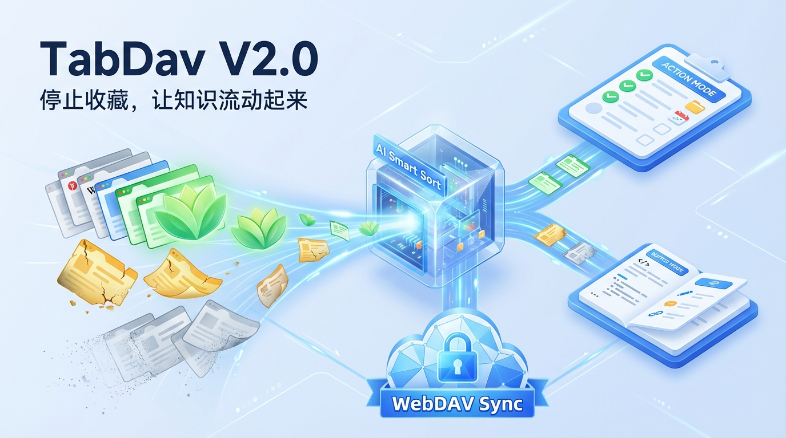

# TabDav V2.0

<div align="center">

**停止收藏，让知识流动起来。**
**不仅仅是收藏。它是你第二大脑的 Web 信息缓冲区。**
**你的数据，你做主。**

<p align="center">
  
  
  
</p>

[English Document](README.md) | [🐞 提交反馈](../../issues)

</div>

---

## 📖 简介

**TabDav** 是一款轻量级、隐私优先的浏览器插件，旨在通过 **WebDAV** 协议帮助你管理并跨设备同步浏览器标签页。

与那些将数据锁定在私有云端的“稍后读”或标签管理工具不同，TabDav 将数据主权交还给你。你可以使用自己的 Nextcloud、SFTPGo、NAS（群晖/威联通）或任何支持 WebDAV 的网盘（如坚果云）来同步数据。



## 📖 重新定义 Tab 管理

在 v2.0 中，**TabDav** 迎来了一次彻底的进化。我们将它从一个封闭的“书签同步工具”重构为一个服务于 Notion/Obsidian 等笔记软件的 **“Web 信息缓冲区 (Browser Buffer)”**。

我们认为，浏览器不应该成为信息的坟墓。
* **TabDav 是内存 (RAM)**：负责暂存、筛选、快速流转。
* **Notion/Obsidian 是硬盘 (HDD)**：负责永久存储。

TabDav 的使命很简单：**增加动力，减少阻力，推动你清空 Tab，完成知识的流转。**

**你的数据完全由你掌控，安全且自由。**

## ✨ 核心功能

* **🔒 隐私至上**：零追踪。你的浏览记录和标签页从未发送给我们的服务器，它们只存在于*你自己的* WebDAV 服务器上。
* **☁️ 跨设备同步**：在公司电脑保存标签，回家后在笔记本上一键还原。
* **⚡ 实用工具箱**：支持**标签分组**管理、一键**导出 Markdown** (完美适配 Obsidian/Notion 笔记) 以及**个性化主题**切换。
* **🌍 多语言支持**：全面支持简体/繁体中文、英语、日语、德语、法语、西班牙语、葡萄牙语和俄语。
* **🚀 轻量极速**：无冗余功能，专为效率设计的简洁 UI。

## 📸 截图预览

### 1. 标签管理
*一键保存当前窗口的所有标签页。*


### 2. 设置与同步
*轻松配置 WebDAV 连接信息。*


### 3. 实用工具
*标签分组管理、一键导出Markdown、自定义规则自动分类。*


### 4. AI分类
*AI一键自动分类*


## ✨ v2.0 核心特性

### 1. 📥 Inbox 与自然熵增 (Natural Entropy)
Inbox 是你的临时停机坪。为了防止囤积，我们引入了基于时间维度的**视觉老化机制**：
* **< 3 天**：文字清晰鲜活，绿色树叶标识。
* **3 - 7 天**：tab标签枯萎，黄色树叶标识。
* **> 7 天**：系统会自动将其归档至历史记录（标识为灰色的风），保持 Inbox 的清爽。

### 2. ⚡ 双模清单系统 (Dual-Mode Lists)
我们不再混淆“要做的事”和“要读的资料”，创建清单时，你可以选择两种模式：

#### ✅ 待办清单 (Action List) —— *For Doing*
* **隐喻**：任务、工单、Jira。
* **交互 - Open & Drop (打开即焚)**：点击标题，网页打开，同时条目**立即从列表中消失**。逼迫你专注当下。

#### 📖 待阅清单 (Buffer List) —— *For Reading*
* **隐喻**：素材、稍后读、资料库。
* **交互 - Open & Keep (打开保留)**：点击标题打开网页，条目保留在列表中。
* **导出清空 - Export & Clear**：点击底部按钮，**一键生成 Markdown 列表**并清空当前清单。完美粘贴至 Obsidian 或 Notion。

### 3. 🧠 AI 智能分类 (AI Smart Sort)
Inbox 堆积如山？让 LLM 帮你完成最后一步的整理工作，而不是仅仅依靠关键词匹配。

#### 🎯 意图优先 (Intent-First) —— *不仅仅是分类，更是理解*
* **隐喻**：经验丰富的私人秘书、图书管理员。
* **逻辑 - 语境识别**：AI 不只看标题，还会分析 URL 结构和你的清单类型。
    * 遇到 `Jira`、`Figma` 或 `GitHub Issues` 链接，它会自动归入 **待办清单 (Action)**。
    * 遇到 `Medium`、`YouTube` 或 `技术博客`，它会自动归入 **待阅清单 (Buffer)**。

#### 🛡️ 绝对秩序 (Zero Chaos) —— *拒绝熵增*
* **隐喻**：收纳师，而非装修队。
* **原则 - 绝不新建**：AI **严禁**自动创建新清单。它只会将 Tab 放入你已建立的容器中。如果 AI 无法确信（置信度低），它会把 Tab 留在 Inbox 让你决定，绝不制造“幻觉分类”。

#### 🔒 数据主权 (BYOK Model) —— *Bring Your Own Key*
* **隐私**：你的 API Key 和数据仅在本地浏览器和 API 提供商（如 OpenAI/DeepSeek）之间传输。**没有中间商，没有数据留存。**

### 4. ⚡️ 自定义规则 (Custom Rules) —— *自动化的精准打击*
对于那些高频访问且意图明确的网站，无需 AI 猜测，你可以设定确定性的规则来实现“秒级分拣”。

* **多种匹配模式**：支持 **域名匹配 (Domain)**、**前缀匹配 (Prefix)** 和 **正则表达式 (RegEx)**。
    * *场景举例*：将所有 `github.com/*/issues` 的链接自动归入 **Work (Action List)**。
    * *场景举例*：将所有 `youtube.com` 的视频自动归入 **Watch Later (Buffer List)**。
* **优先级最高**：系统会优先执行你设定的规则。只有未命中任何规则的 Tab，才会交给 AI 或留在 Inbox。
* **可视化测试**：在创建规则时，你可以直接输入 URL 进行测试，确保规则逻辑符合预期（所见即所得）。

## 🛠 安装指南

### 方法 1：加载已解压的扩展程序 (推荐)
1.  下载本仓库的最新 Release 代码或 Clone 到本地编译。
2.  打开 Chrome 或 Edge 浏览器，访问 `chrome://extensions/`。
3.  开启右上角的 **开发者模式 (Developer mode)**。
4.  点击 **加载已解压的扩展程序 (Load unpacked)**，选择本项目文件夹。

### 方法 2：应用商店安装
* *Chrome 应用商店: [敬请期待]*
* *Edge 插件商店: [敬请期待]*

## ⚙️ 配置教程

1.  点击浏览器工具栏上的 **TabDav 图标**。
2.  点击右上角的 **设置 (齿轮)** 图标。
3.  输入你的 WebDAV 信息：
    * **服务器地址 (URL)**: 例如 `https://dav.jianguoyun.com/dav/` (坚果云) 或你的 NAS 地址。
    * **用户名**: WebDAV 用户名。
    * **密码**: WebDAV 密码 (建议使用应用专用密码)。
4.  点击 **保存**。如果连接成功，你就可以开始同步了！

### ✅ WebDAV 服务器兼容性

我们已在以下环境中测试并通过验证：

* **坚果云**：云盘根目录新建“tabdav”目录，服务地址填写：https://dav.jianguoyun.com/dav/tabdav/
* **SFTPGo**：需要设置CORS相关环境变量，如SFTPGO_WEBDAVD__CORS__ENABLED、SFTPGO_WEBDAVD__CORS__ALLOWED_ORIGINS、SFTPGO_WEBDAVD__CORS__ALLOWED_METHODS等环境变量。
* **Nextcloud**
* **ownCloud**
* **Seafile**
* 其他标准 WebDAV 协议服务器

### ⚠️ 关于 CORS 跨域配置的重要说明（自建服务必读）

由于 TabDav 是直接在浏览器环境中运行的插件，它必须遵循浏览器的 **跨域资源共享 (CORS)** 安全策略。

如果您使用的是自建的 WebDAV 服务（例如使用 Nginx、Apache 自建，或某些 NAS 的默认设置），您 **必须** 确保服务端满足以下配置，否则会连接失败：

1.  **允许跨域请求**：服务端必须返回 `Access-Control-Allow-Origin` 响应头（值为 `*` 或本插件的 ID）。
2.  **放行 `OPTIONS` 请求**：浏览器会在发送数据前自动发送一个 `OPTIONS` 预检请求，服务端必须对该请求返回 `200 OK` 状态码。
3.  **允许自定义 Headers**：请确保 `Access-Control-Allow-Headers` 中包含 `Content-Type`, `Authorization`, `Depth` 等字段。

*注：大多数商业网盘（如坚果云）已默认支持此配置。此问题主要出现在自建 WebDAV 服务或反向代理配置中。*

## 💻 本地开发

如果你想参与贡献或自己构建：

```bash
# 1. 克隆仓库
git clone [https://github.com/HatBoy/TabDav.git](https://github.com/HatBoy/TabDav.git)

# 2. 安装依赖
npm install

# 3. 打包构建
npm run build
```